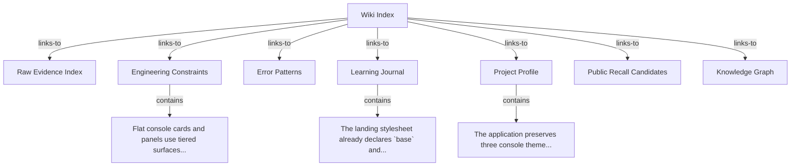

# Knowledge Graph

This graph is generated from repo-memory source layers and carries both deterministic structure plus model-maintained high-confidence semantic relations.

```mermaid
graph TD
  wiki_index["Wiki Index"]
  node_docs_agent_knowledge_raws_index_md["Raw Evidence Index"]
  node_docs_agent_knowledge_engineering_constraints_md["Engineering Constraints"]
  node_docs_agent_knowledge_error_patterns_md["Error Patterns"]
  node_docs_agent_knowledge_learning_journal_md["Learning Journal"]
  node_docs_agent_knowledge_project_profile_md["Project Profile"]
  node_docs_agent_knowledge_public_recall_candidates_md["Public Recall Candidates"]
  node_docs_agent_knowledge_wiki_knowledge_graph_md["Knowledge Graph"]
  entry_docs_agent_knowledge_engineering_constraints_md_1edad76abdf6["Flat console cards and panels use tiered surfaces..."]
  entry_docs_agent_knowledge_project_profile_md_4d444957dd1e["The application preserves three console theme..."]
  entry_docs_agent_knowledge_learning_journal_md_516e50b0bcf4["The landing stylesheet already declares `base` and..."]
  node_docs_agent_knowledge_engineering_constraints_md -->|contains| entry_docs_agent_knowledge_engineering_constraints_md_1edad76abdf6
  node_docs_agent_knowledge_learning_journal_md -->|contains| entry_docs_agent_knowledge_learning_journal_md_516e50b0bcf4
  node_docs_agent_knowledge_project_profile_md -->|contains| entry_docs_agent_knowledge_project_profile_md_4d444957dd1e
  wiki_index -->|links-to| node_docs_agent_knowledge_engineering_constraints_md
  wiki_index -->|links-to| node_docs_agent_knowledge_error_patterns_md
  wiki_index -->|links-to| node_docs_agent_knowledge_learning_journal_md
  wiki_index -->|links-to| node_docs_agent_knowledge_project_profile_md
  wiki_index -->|links-to| node_docs_agent_knowledge_public_recall_candidates_md
  wiki_index -->|links-to| node_docs_agent_knowledge_raws_index_md
  wiki_index -->|links-to| node_docs_agent_knowledge_wiki_knowledge_graph_md
```
